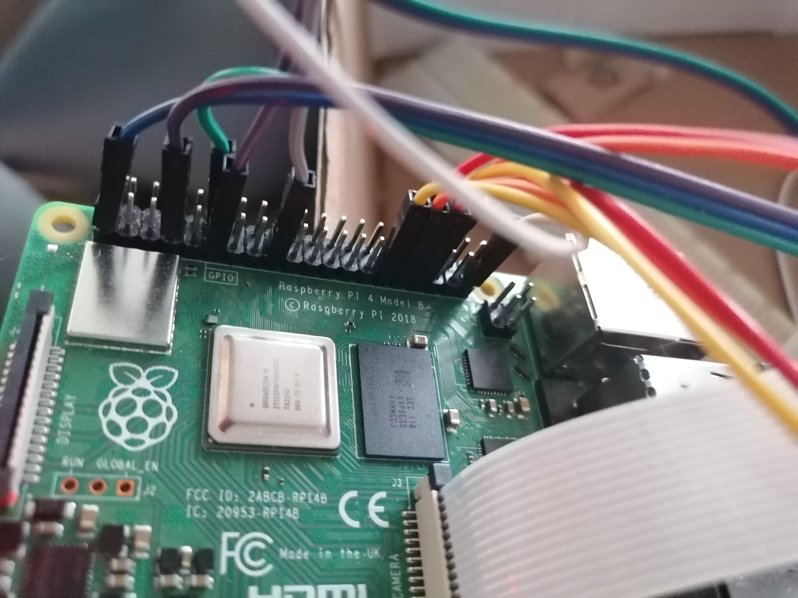
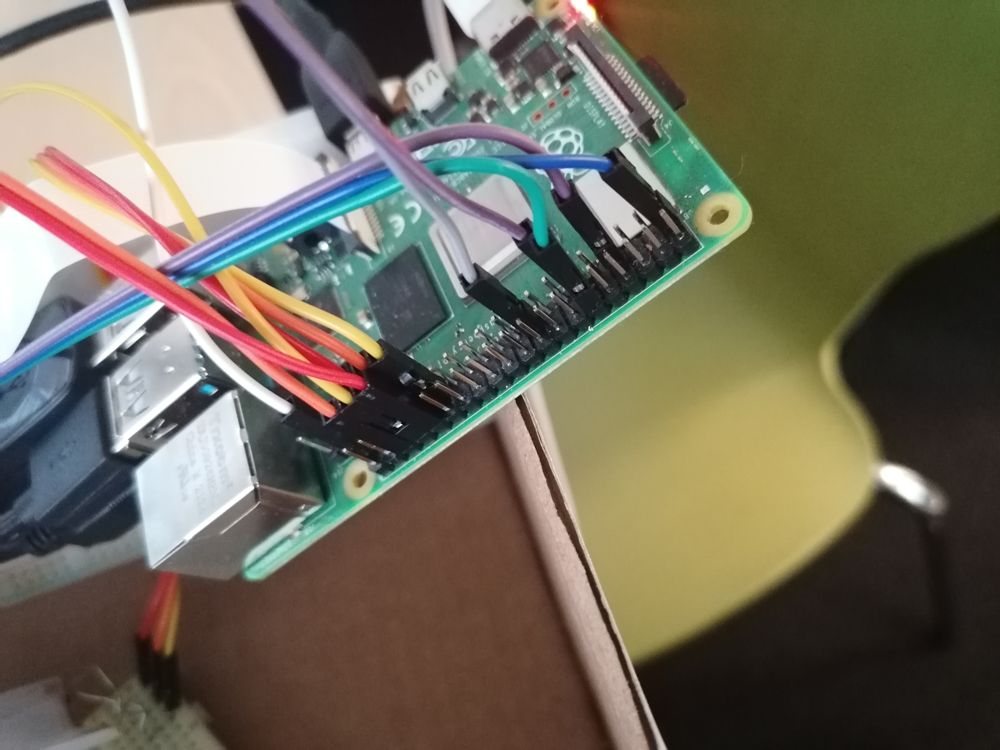
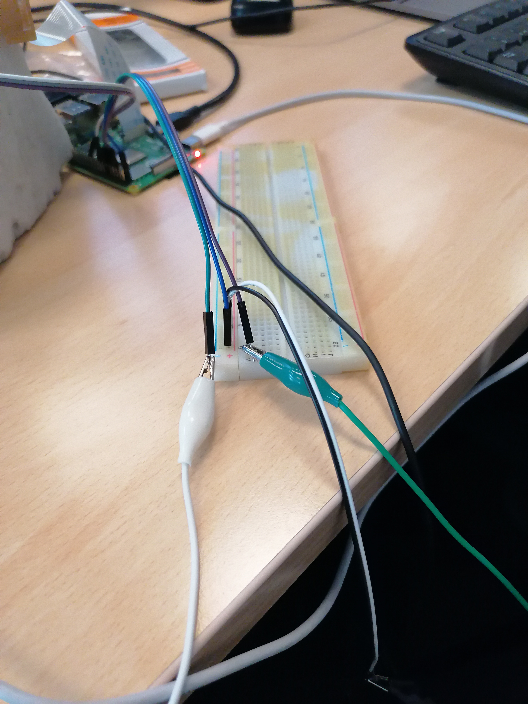
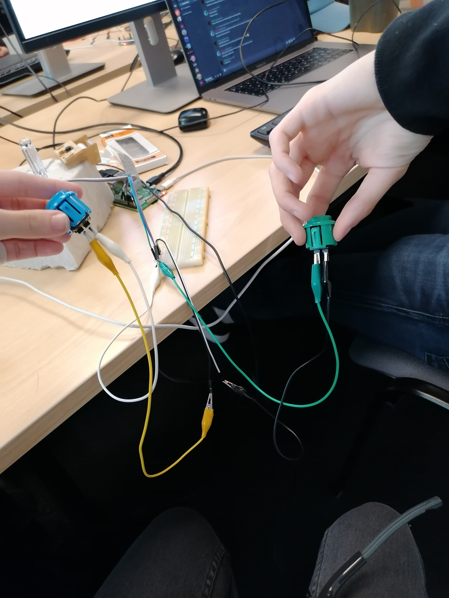
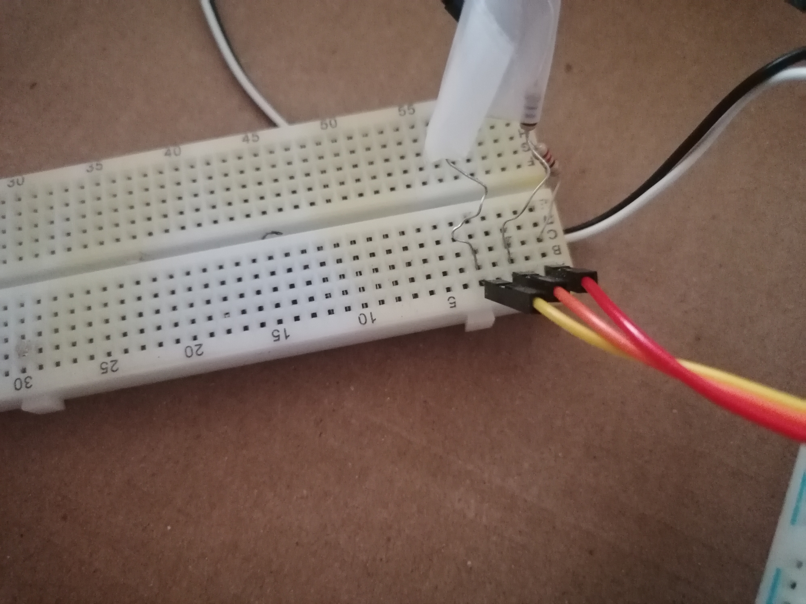

# Project 2

## Installation

```
pip install -r requirements.txt
apt-get install sox
```


## Branchements





### Pins

- Bouton pour caméra : 
  - Signal sur alim 3.3V (pin 17)
  - Negative sur GPIO 17 (pin 11)


- Bouton pour enregistrement (bleu):
  - Positive sur alim 3.3v
  - Negative sur GPIO 18 (pin 12)
- Bouton pour écoute (vert):
  - Positive sur alim 3.3v
  - Negative sur GPIO 4 (pin 7)




- Camera:
  - PiCamera
  - Nape sur le Pi
- Micro/Audio:
  - Connecté par USB
- Led pour la caméra (led smd rgb) ⚠️besoin de resistance !!:
  - R sur GPIO 5 (pin 29) (resistance: 180Ω)
  - G sur GPIO 6 (pin 31) (resistance 110Ω)
  - B sur GPIO 13 (pin 33) (resistance 110Ω)
  - Negative sur une masse



- Potentiometre pour les modes:
  - DT sur GPIO 12 (pin 32)
  - CLK sur GPIO 16 (pin 36)
  - Positive sur alim 3.3v
  - Negative sur masse
- Potentiometre pour les modes:
  - DT sur GPIO 23 (pin 16)
  - CLK sur GPIO 24 (pin 18)
  - Positive sur alim 3.3v
  - Negative sur masse
