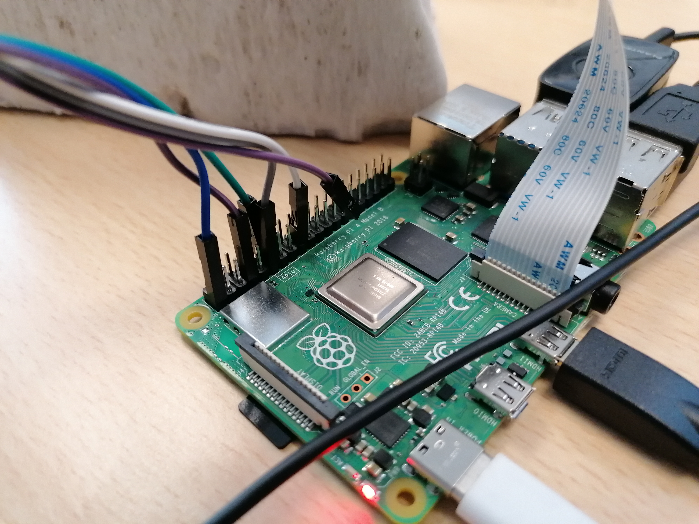

# Project 2

## Installation

`pip install -r requirements.txt`

## Branchements

### Pins

- Bouton pour caméra : 
  - Signal sur alim 3.3V (pin 17)
  - Negative sur GPIO 17 (pin 11)
- Bouton pour enregistrement (bleu):
  - Positive sur alim 3.3v
  - Negative sur GPIO 18 (pin 12)
- Bouton pour écoute (vert):
  - Positive sur alim 3.3v
  - Negative sur GPIO 4 (pin 7)
- Camera:
  - PiCamera
  - Nape sur le Pi
- Micro/Audio:
  - Connecté par USB
